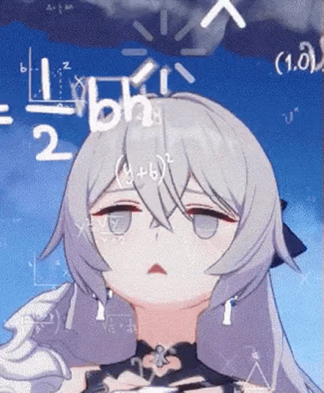

  <!-- Ganti banner.png sesuai nama file yang Anda upload -->
  

  # 🎮 Greetings, Captain!
  
<em>"Bronya will execute the mission with 100% precision."</em>

  

 

### 🛠️ Tech Stack & Arsenal

  
  
  
  

 

### 📊 Combat Diagnostics

  <!-- Ganti USERNAME_KAMU dengan username GitHub Anda -->
  
  

